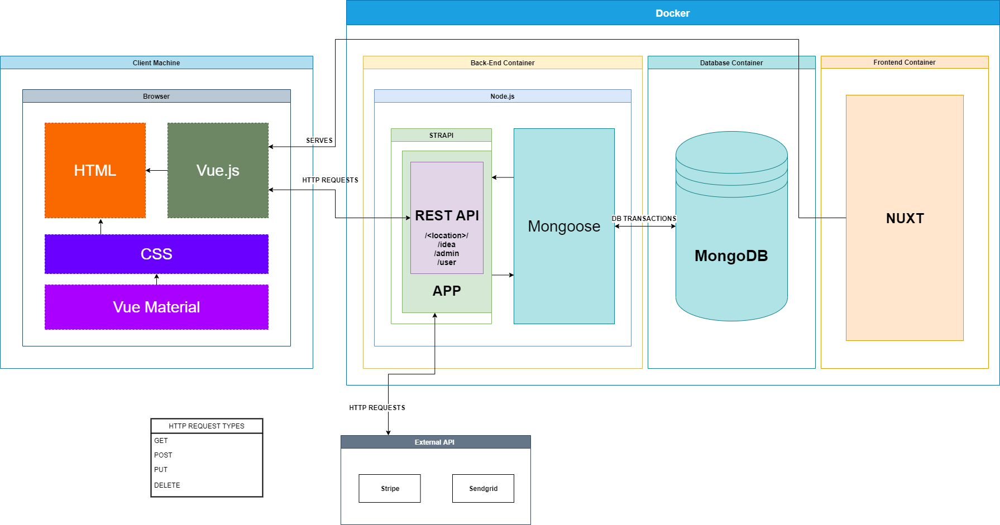
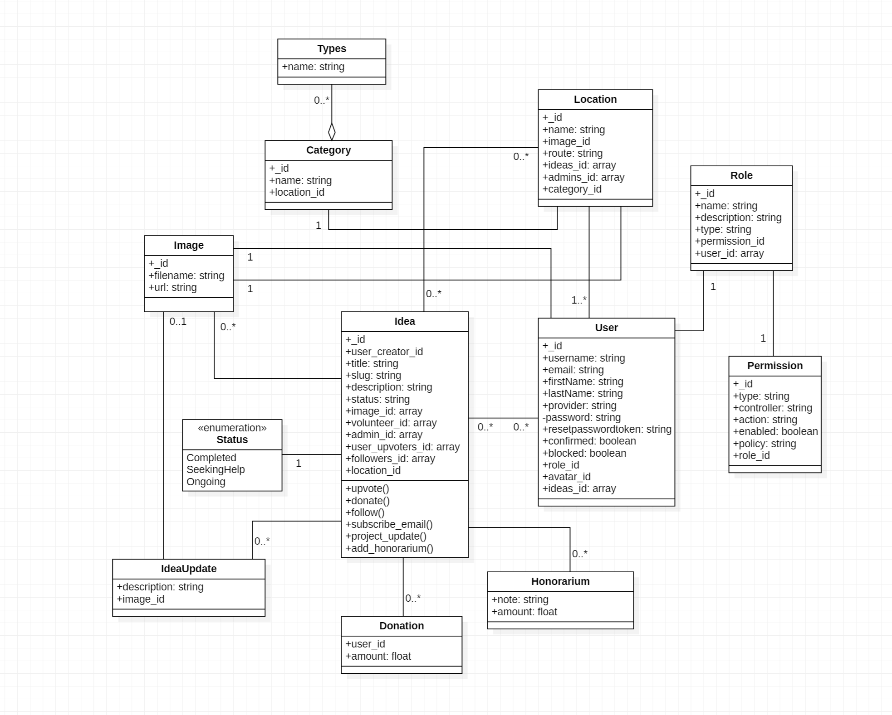
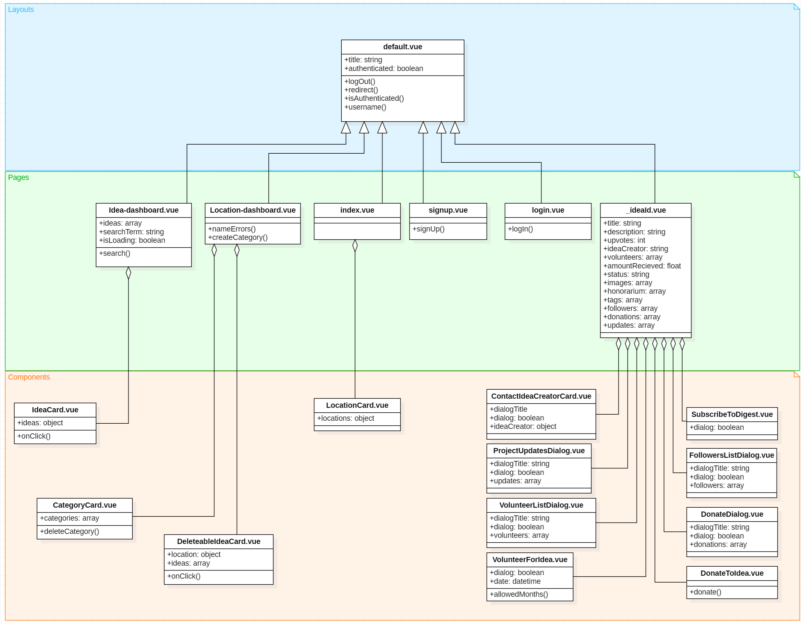
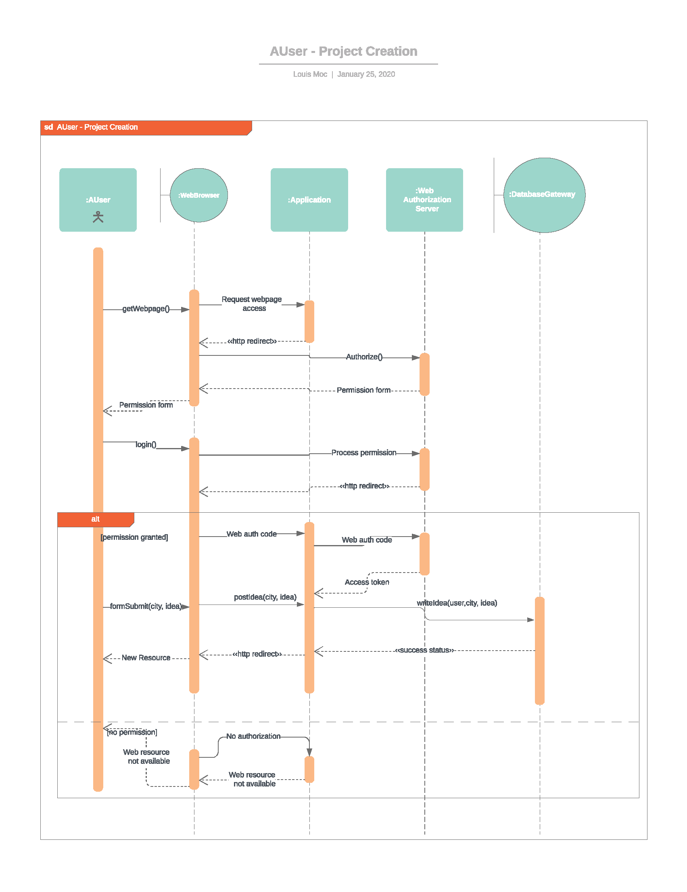
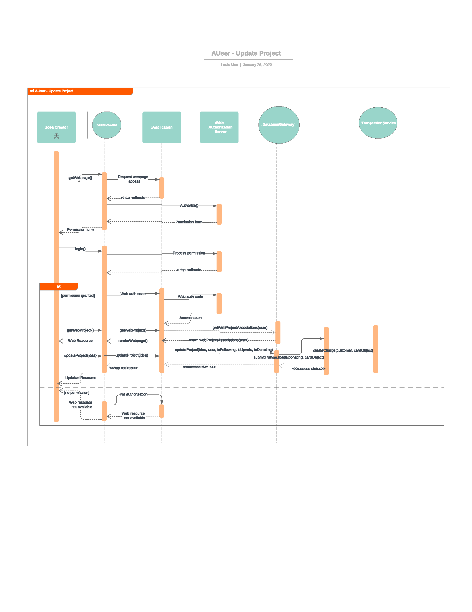
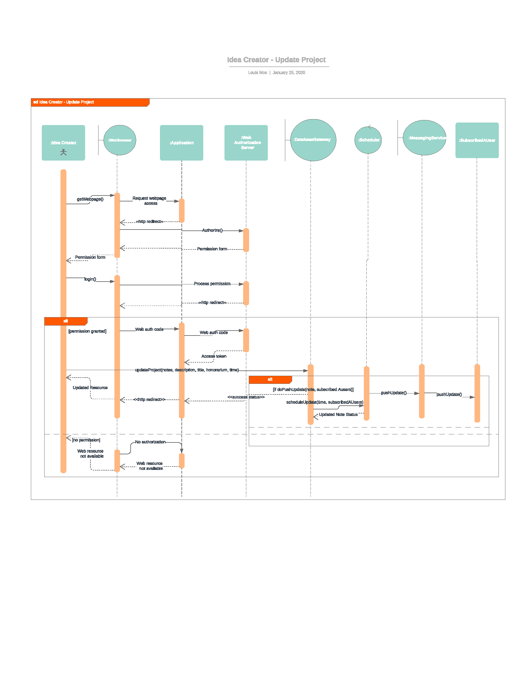
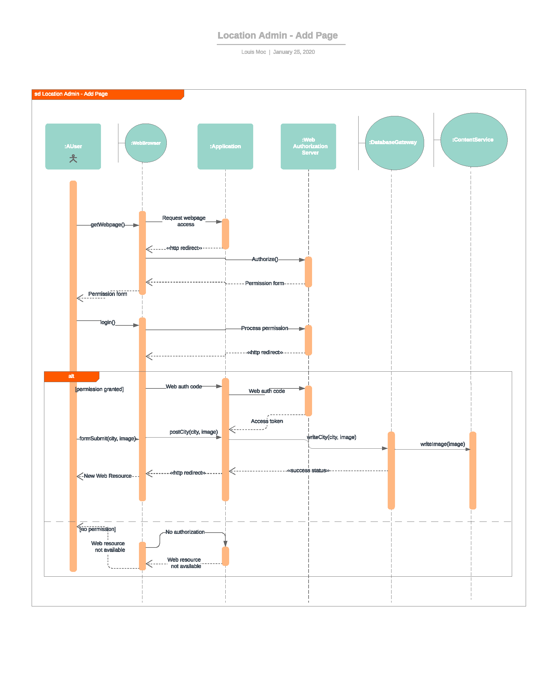
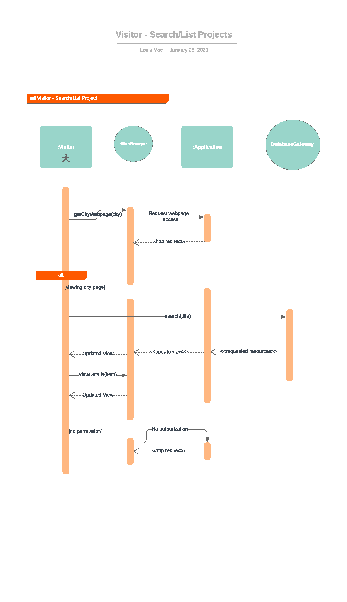

# Software Design

## Architecture/Component Diagram
### January, 26th, 2020 ( Csaba Nagy )

Software design highlights a common web application structure broken into a client side / backend logic communicating over a REST API. 

Client side Vue.js driven HTML Application that communicates with the backend over a REST API and renders the page. Design is based on the bootstrap framework providing the styling / responsive aspects of the web application. 

Backend is Dockerized solution comprised of three major components, that being the backend container, database container and frontend container. The backend container contains all the relevant application / business logic that will handle User Authentication, Authorization, REST API functionality, Connection to 3rd Party APIs and Connection to the database ( using STRAPI ). Dockerization is an important component of this project as it was designed to be an easily replicable project for others to clone and spin up their own versions of.

## UML Class Diagram
### January, 26th, 2020 ( Csaba Nagy )

UML Component Entity Diagram ( Models )

UML Vue Component Diagram ( Views )

## Sequence Diagram
### January, 25th, 2020 ( Louis Moc )

